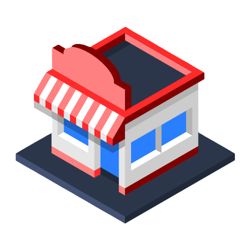

<p align="center">
  
</p>
<h1 align="center">My Market</h1>
<p align="center">Una tienda amigable que crece contigo, asegurando una experiencia única en cada compra.</p>

## Progreso y Tecnologías
Entrega de la semana **Diseños y Estilos** del proyecto My Market, en la que se usaron las siguientes tecnologías:


## Instrucciones para ejecutar
1. Clonar este repositorio con el siguiente comando:
```
git clone https://github.com/FatimaGR/BOOTCAMP-FRONTEND-REACT-NTT.git
```
2. Dentro del proyecto, cambiar a la rama `feature/diseños-y-estilos`:
```
git checkout feature/diseños-y-estilos
```
3. Abrir `index.html` en el navegador para ver el proyecto.

> **Nota**: No se requiere configuración adicional por ahora.

## Descripción general


### Funcionalidades implementadas
- [ ✓ ] Correcto uso de HTML5 y CSS3.
- [ ✓ ] Uso de flexbox.
- [ ✓ ] Diseño responsive con media queries.
- [ ✓ ] Uso de efectos CSS3.

### Cambios adicionales
- **Mejoras en el diseño:** Opté por crear un diseño moderno y amigable, con una paleta de colores pasteles que transmiten tranquilidad y comodidad al usuario.
- **Efectos visuales:** Agregué efectos sencillos para ayudar al usuario a identificar los elementos interactivos.
- **Accesibilidad:** Agregué etiquetas `aria-label`, para mejorar la accesibilidad de la página para personas con discapacidades visuales.
- **Idioma:** Opté por cambiar el idioma de la página a inglés para mantener la coherencia con los datos de la API que se consumirá más adelante.

### Arquitectura de carpetas
La estructura de carpetas se organizó de la siguiente manera:
- `readme-images/` almacena las imágenes que se utilizan exclusivamente en el archivo README.md para documentar el progreso y los resultados visuales del proyecto.
- `assets/` agrupa todos los recursos visuales y de diseño utilizados en la interfaz del proyecto.
  - `icons/` contiene los íconos SVG.
  - `images/` almacena imágenes como fotos de productos u otros elementos visuales de contenido.
- `README.md` archivo de documentación que describe la estructura, funcionalidad y tecnologías empleadas en el proyecto.
- `index.html` incluye la estructura principal del proyecto.
- `style.css` incluye los estilos de diseño, colores, tipografía, layout y efectos interactivos.

## ¡Sigue el progreso de My Market! 🚀

✨ ¡Gracias por visitar el proyecto My Market! ✨

Este proyecto está en constante crecimiento, así que te invito a seguirlo para ver cómo evoluciona esta tienda amigable. 

Para obtener una descripción general completa, puedes visitar el README principal en la [rama main](https://github.com/FatimaGR/BOOTCAMP-FRONTEND-REACT-NTT/tree/main).

## Realizado por
- Website - [Fatima Gallardo](https://porfolio-website-gules.vercel.app)
- GitHub - [@FatimaGR](https://github.com/FatimaGR)