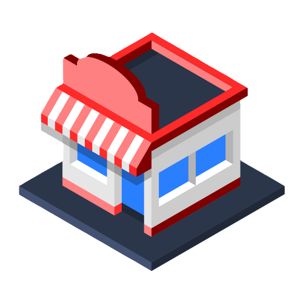
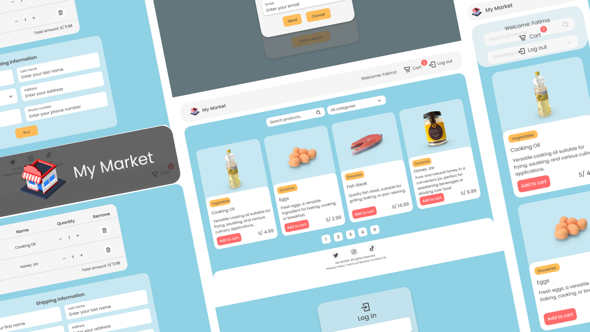

  

<h1 align="center">My Market</h1>

Una tienda amigable que crece contigo, asegurando una experiencia única en cada compra.

 

## Descripción general
**My Market** es un proyecto que crecerá progresivamente, hasta tener el resultado de una tienda en línea, con las siguientes funcionalidades principales:

- Búsqueda de productos
- Filtro de productos según su categoría
- Carrito de compras y resumen de productos
- Inicio de sesión y recuperación de contraseña
- Interfaz responsiva y amigable

 

## Tecnologías
Las tecnologías con las que se realizará el proyecto serán las siguientes:

## Progreso
Se realizarán entregas, con cada una se agregarán nuevas tecnologías y funcionalidades al proyecto. Al finalizar el proyecto, el respositorio tendrá 7 ramas en total, una por cada entrega.

Las ramas serán las siguientes:

1. [feature/diseños-y-estilos:](https://github.com/FatimaGR/BOOTCAMP-FRONTEND-REACT-NTT/tree/feature/diseños-y-estilos) Estarán los primeros archivos del proyecto, tanto la estructura como diseños realizados con HTML5 y CSS3.
2. [feature/javascript:]() Estará lo realizado en la rama anterior pero combinado con JavaScript.
3. [feature/typescript:]() Se transformará lo que se desarrolló en la rama anterior a TypeScript.
4. [feature/react-fundamentos:]() Se migrará el proyecto HTML5 + TypeScript a React + TypeScript.
5. [feature/react-implementacion:]() Se agregará una nueva página "Resumen", con la lista de productos del carrito de compras y un formulario de envío.
6. [feature/pruebas-unitarias:]() Se testearán todos los archivos del proyecto, tanto componentes, hooks, utilitarios, páginas, etc.
7. [feature/proyecto-integrador:]() Se finalizará el proyecto integrando una página "Login" y un modal "Olvidé mi contraseña".

En cada rama se encontará un archivo `README.md` con la descripción de lo realizado en la entrega, las tecnologías utilizadas, las instrucciones para ejecutar el proyecto, los requerimientos cumplidos y las implementaciones adicionales.

## Créditos
Proyecto desarrollado como parte del Bootcamp de Frontend en React - Programa **Tech Girls Power** de NTT Data 👩🏻‍💻💙

## Realizado por
Hola, soy Fátima, una desarrolladora Front-end Jr. emocionada por hacer que sus ideas cobren vida a través de proyectos que ayuden a las personas. Puedes conocer más sobre mi perfil y mis proyectos en:

- Website - [Fatima Gallardo](https://porfolio-website-gules.vercel.app)
- GitHub - [@FatimaGR](https://github.com/FatimaGR)

Gracias por visitar y seguir el desarrollo de **My Market**. ¡Espero que disfrutes del recorrido! 🚀✨