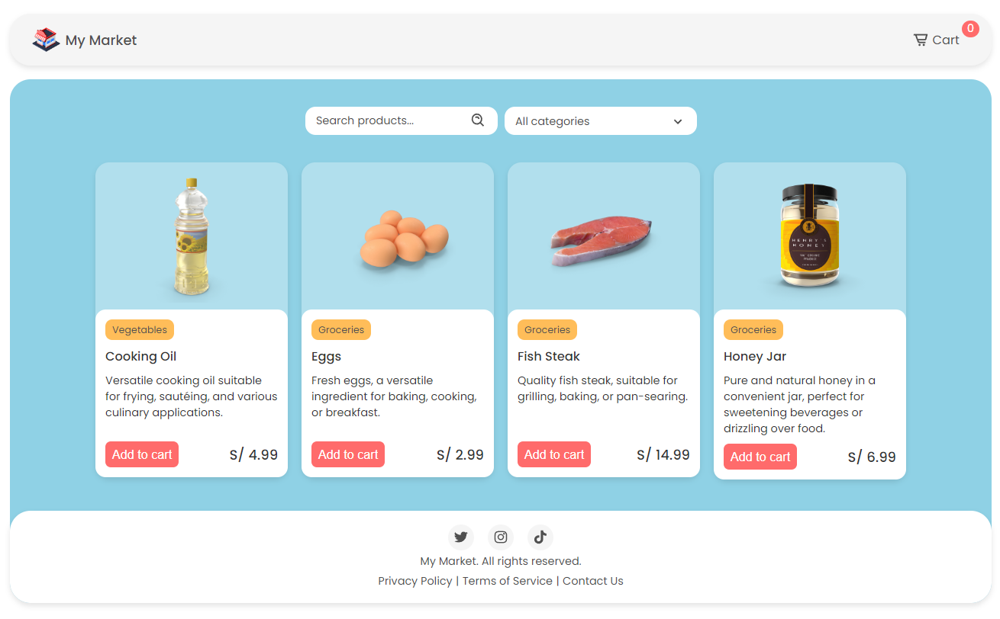

<p align="center">
  
</p>
<h1 align="center">My Market</h1>
<p align="center">Una tienda amigable que crece contigo, asegurando una experiencia única en cada compra.</p>

<br>

## Progreso y Tecnologías
Entrega de la semana **TypeScript** del proyecto My Market, en la que se usaron las siguientes tecnologías:


## Instrucciones para ejecutar
1. Clonar este repositorio con el siguiente comando:
```
git clone https://github.com/FatimaGR/BOOTCAMP-FRONTEND-REACT-NTT.git
```
2. Dentro del proyecto, cambiar a la rama `feature/javascript`:
```
git checkout feature/typescript
```
3. Instalar las dependencias con el siguiente comando:
```
npm install
```
4. Abrir en el navegador para ver el proyecto, con el siguiente comando:
```
npm run dev
```

## Descripción general


### Funcionalidades implementadas
- [ ✓ ] Migración del cógido, de JavaScript a TypeScript.
- [ ✓ ] Uso correcto de interfaces y types.
- [ ✓ ] Creación correcta de carpetas para separar la lógica de negocio de las estructuras definidas como las interfaces o types.

### Arquitectura de carpetas
La estructura de carpetas se organizó de la siguiente manera:
- `src/` carpeta raíz del código fuente, contiene todo el código necesario para el proyecto, organizado en subcarpetas.
  - `assets/` contiene todos los recursos visuales y de diseño utilizados en la interfaz del proyecto.
  - `components` contiene todos los componentes UI reutilizables de la aplicación.
  - `pages` contiene las páginas principales de la aplicación.
  - `services` contiene todo el código relacionado con la lógica de la API.
  - `styles` contiene los archivos con estilos CSS.
  - `utils` contiene funciones reutilizables.
- `readme-images/` contiene las imágenes que se utilizan exclusivamente en el archivo README.md para documentar el progreso y los resultados visuales del proyecto.
- `index.html` incluye la estructura principal del proyecto.
- `package.json` incluye las dependencias y configuración del proyecto.
- `README.md` archivo de documentación que describe la estructura, funcionalidad y tecnologías empleadas en el proyecto.

## ¡Sigue el progreso de My Market! 🚀

✨ ¡Gracias por visitar el proyecto My Market! ✨

Este proyecto está en constante crecimiento, así que te invito a seguirlo para ver cómo evoluciona esta tienda amigable. 

Para obtener una descripción general completa, puedes visitar el README principal en la [rama main](https://github.com/FatimaGR/BOOTCAMP-FRONTEND-REACT-NTT/tree/main).

## Realizado por
Hola, soy Fátima, una desarrolladora Front-end Jr. emocionada por hacer que sus ideas cobren vida a través de proyectos que ayuden a las personas. Puedes conocer más sobre mi perfil y mis proyectos en:
- Website - [Fatima Gallardo](https://porfolio-website-gules.vercel.app)
- GitHub - [@FatimaGR](https://github.com/FatimaGR)